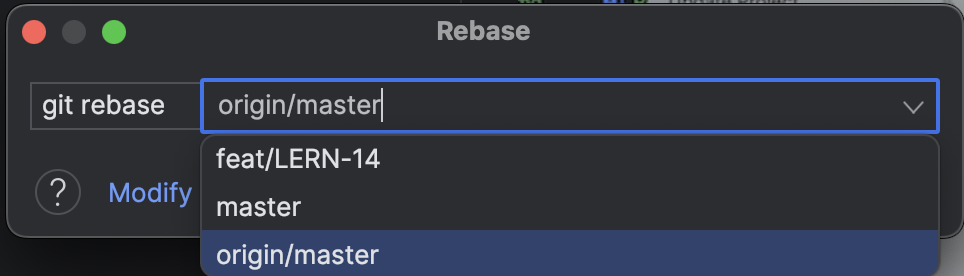
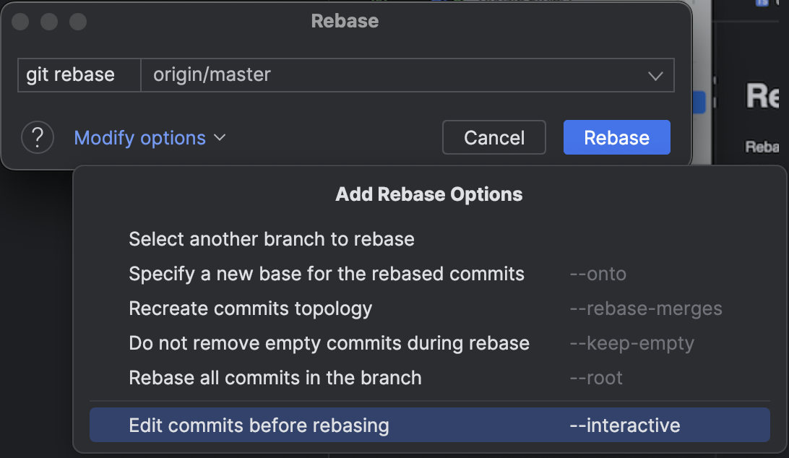
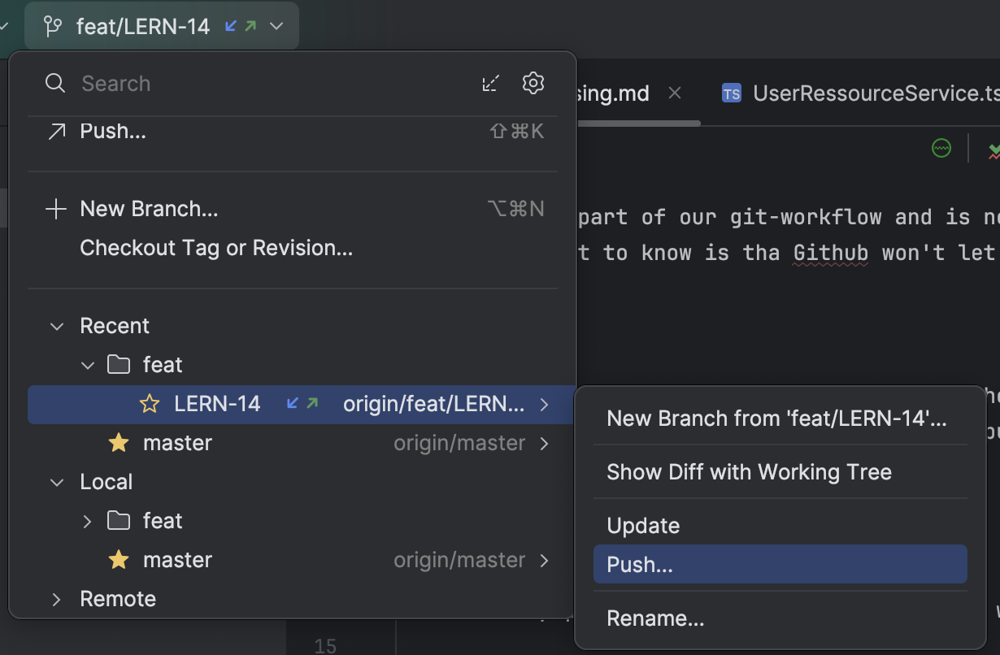
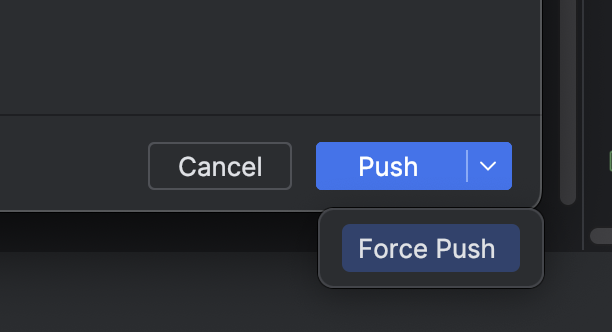

# Rebasing 

Rebasing is a part of our git-workflow and is needed to update your feature branch with the newest changes on the master branch.
Also, important to know is tha Github won't let you merge your branch on to the master branch when its out of date 😉.

## How to

To perform a rebase you need have the branch checked out into which you want to rebase the master. 
Then make sure to update the master branch to pull the latest changes from the Github repo.
Then in IntelliJ go to Git -> Rebase...

No comes a pop-up. There choose the branch you want to rebase from. In our case the origin/master.

Next Modify the options. Select --interactive so you can squash and rename commits.

Now you can Rebase your branch with the master branch. 

After rebasing it is important to do a *force push*. To do this you got to your branch -> and push.
If you are not sure if you have to force push look at the branch and if you see two arrows like in the picture you have to performe a force push.

Then in the push window make sure you expand the push button and use the force push option.

Sometimes rebasing can lead to merge conflicts when something has been changed on the master branch and also from you. You can then resolve the merge conflicts by choosing which lines of code from which branch you want to keep.
To minimize the merge conflicts its best practice to regularly rebase your branch so its always up to date.

### Squashing

When you have enabled the --interactive flag during rebasing you have the options to squash multiple commits into one.
Best practice here is, before you make a pull-request squash everything into one commit, or two if there have been big changes, to keep the commit history simple and to make it easier for the reviewer. 

